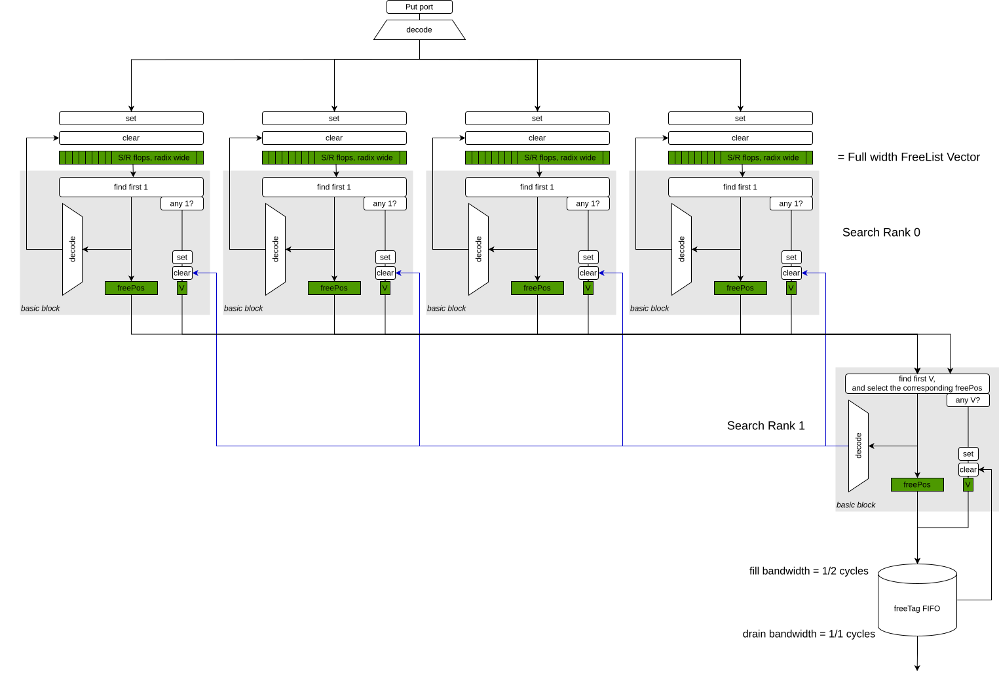

# FreeSet

The FreeSet library component implements large-scale resource management.
The FreeSet offers allocation and deallocation of a numbered resource (tag).
The number of tags can be arbitrarily large. It does not need to be a power of 2.
The FreeSet design is optimized for area.

The availability of each tag is stored in a flop; one flop per tag.
When the flop output at position X is 1, tag X is free.

At the output of the module, the FreeSet has a Valid/Ready interface.
The output offers a tag that can be allocated, if one is available.

The FreeSet has one or more put ports, to give back entries that are no longer needed.
Each put port can be used every cycle. A put port is always ready.

When a tag is returned, it takes a minimum number of clock cycles before the tag can be reused.
This re-allocation latency only matters if the FreeSet was empty, which is not supposed to happen frequently.

## Implementation details

The FreeSet is searched hierarchically.
The search tree consists of multiple ranks.
Each rank is built from basic blocks of size `radix`.
The radix is a power of 2.

The diagram shows the arrangement of the basic blocks and their interconnect.



*FreeSet data path diagram with 2 ranks and radix=4.*

At the top of the tree, the vector of FreeSet flops is split into groups of size `radix`.
Each group connects to the corresponding basic block.

Within each group, if a free tag is found, the basic block identifies the lowest-numbered free tag.
The tag is offered at the output of the block, with the valid output turning high.
When a downstream rank accepts the offered tag, the valid bit is cleared again.

The concatenation of the valid bits of a rank is used as input for the next rank.
The process of creating groups is repeated until the root node of the tree is reached.

A basic block can deliver one free tag per two cycles.

An output FIFO of depth N makes sure that a burst of N free tags can be delivered without stalls.
The FIFO fill rate is 1 per 2 cycles, the FIFO drain rate is 1 per cycle.

## Test

To run a functional test for particular parametrizations, and generate a waveform, execute:

``` sbt "testOnly chisel.lib.freeset.FreeSetTest" -- -DwriteVcd=1 ```

## References

The design was presented at ORConf 2026. Slides and presentation recording are available here:

[ORConf 2026 Resource Set Manager Circuit in Chisel](https://fossi-foundation.org/orconf/2026#resource-set-manager-circuit-in-chisel)
